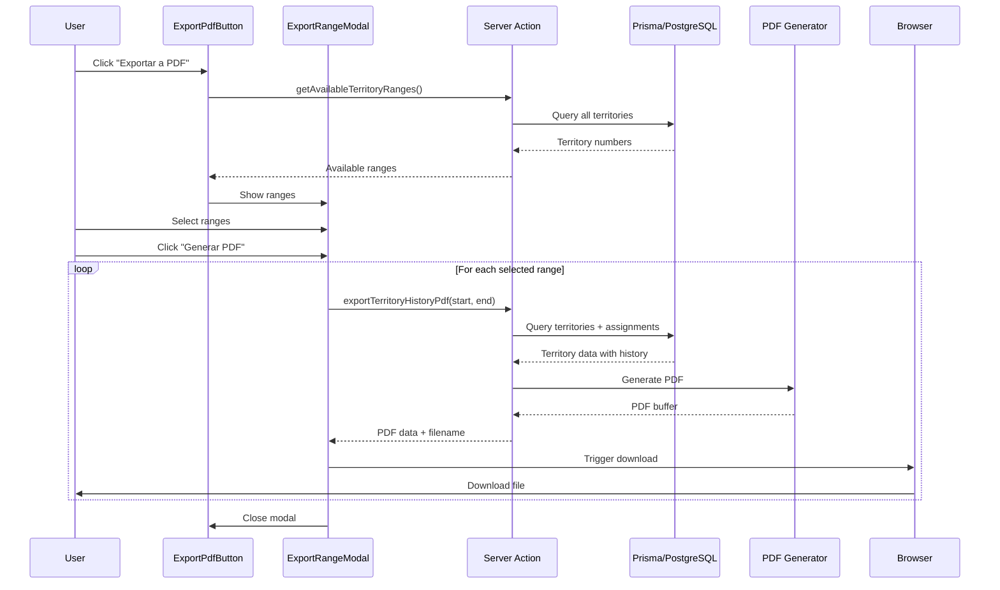

# Design Document: Export Territory History to PDF

## Overview

This feature enables administrators to export territory assignment history as PDF documents that replicate the official S-13-S "Registro de asignación de territorio" format. The system will generate printable PDF files showing complete assignment history organized in a column-based layout, with each territory displayed in its own column showing chronological assignment records.

### Goals

- Generate PDF documents matching the official S-13-S format exactly
- Display unified history combining both conductor and personal assignments
- Organize territories in ranges of 10 (1-10, 11-20, etc.) across 2-page documents
- Provide intuitive UI for range selection and export from the History page
- Enable administrators to maintain physical records matching digital data

### Non-Goals

- Real-time PDF preview before download
- PDF editing or annotation capabilities
- Custom template creation or format customization
- Exporting individual territory histories separately
- Multi-language PDF generation

## Architecture

### High-Level Architecture

```mermaid
graph TB
    UI[Export UI Component] --> Modal[Range Selection Modal]
    Modal --> Validate[Validation Layer]
    Validate --> Action[Server Action]
    Action --> Query[Data Query Service]
    Query --> DB[(Prisma/PostgreSQL)]
    Action --> Generator[PDF Generator]
    Generator --> Renderer[@react-pdf/renderer]
    Renderer --> Buffer[PDF Buffer]
    Buffer --> Download[Client Download]
```

### Component Architecture


**Client-Side Components:**
- `ExportPdfButton`: Trigger button in History page
- `ExportRangeModal`: Modal for selecting territory ranges
- `RangeSelector`: Checkbox list for range selection

**Server-Side Components:**
- `exportTerritoryHistoryPdf`: Server action orchestrating export
- `getTerritoryHistoryForExport`: Data retrieval service
- `S13SPdfDocument`: React-PDF document component
- `TerritoryColumn`: React-PDF column component for individual territories

### Technology Stack

- **PDF Generation**: @react-pdf/renderer v4.x (JSX-based PDF creation with server-side rendering)
- **Data Layer**: Prisma ORM with PostgreSQL
- **Server Actions**: Next.js Server Actions for secure server-side processing
- **UI Framework**: React with Tailwind CSS
- **Date Formatting**: date-fns (already in project)

### Why @react-pdf/renderer?

Content rephrased for compliance with licensing restrictions:

This library was selected because it generates PDFs using familiar JSX syntax, works seamlessly on the server side with Next.js, produces print-ready documents without browser dependencies, and provides precise control over layout for replicating the S-13-S format. Alternative approaches like jsPDF or PDFKit would require more manual positioning logic.

## Components and Interfaces

### Client Components

#### ExportPdfButton


**Location**: `components/admin/ExportPdfButton.tsx`

```typescript
'use client'

interface ExportPdfButtonProps {
  availableRanges: TerritoryRange[]
}

export function ExportPdfButton({ availableRanges }: ExportPdfButtonProps)
```

**Responsibilities:**
- Display prominent button with FileDown icon
- Open/close export modal
- Trigger PDF generation on confirmation
- Handle loading states and error display

#### ExportRangeModal

**Location**: `components/admin/ExportRangeModal.tsx`

```typescript
interface ExportRangeModalProps {
  isOpen: boolean
  onClose: () => void
  availableRanges: TerritoryRange[]
  onExport: (selectedRanges: number[]) => Promise<void>
}

export function ExportRangeModal(props: ExportRangeModalProps)
```

**Responsibilities:**
- Display available territory ranges with counts
- Allow multi-select via checkboxes
- Show validation messages
- Display generation progress
- Auto-close on successful export

### Server Components & Actions

#### exportTerritoryHistoryPdf

**Location**: `server/territoryExport.ts`


```typescript
'use server'

export async function exportTerritoryHistoryPdf(
  startNumber: number,
  endNumber: number
): Promise<{ success: boolean; data?: Uint8Array; filename?: string; message?: string }>
```

**Responsibilities:**
- Validate territory range (1-10 territories)
- Fetch unified assignment history for range
- Generate PDF document using React-PDF
- Return PDF buffer with filename
- Handle errors gracefully

#### getTerritoryHistoryForExport

**Location**: `server/territoryExport.ts`

```typescript
async function getTerritoryHistoryForExport(
  startNumber: number,
  endNumber: number
): Promise<TerritoryExportData[]>
```

**Responsibilities:**
- Query territories in range with all assignments
- Combine Assignment and PersonalAssignment records
- Sort chronologically (oldest first)
- Format data for PDF generation
- Handle territories with no history

#### getAvailableTerritoryRanges

**Location**: `server/territoryExport.ts`

```typescript
export async function getAvailableTerritoryRanges(): Promise<TerritoryRange[]>
```

**Responsibilities:**
- Query all territory numbers from database
- Calculate ranges of 10 consecutive territories
- Count territories in each range
- Return formatted range options

### PDF Components

#### S13SPdfDocument

**Location**: `components/pdf/S13SPdfDocument.tsx`


```typescript
import { Document, Page } from '@react-pdf/renderer'

interface S13SPdfDocumentProps {
  territories: TerritoryExportData[]
  rangeLabel: string
}

export function S13SPdfDocument({ territories, rangeLabel }: S13SPdfDocumentProps): JSX.Element
```

**Responsibilities:**
- Create 2-page PDF document
- Render document header with title and range
- Split 10 territories across 2 pages (5 per page)
- Apply S-13-S styling and spacing
- Handle territories with empty history

#### TerritoryColumnComponent

**Location**: `components/pdf/TerritoryColumn.tsx`

```typescript
import { View, Text } from '@react-pdf/renderer'

interface TerritoryColumnProps {
  territory: TerritoryExportData
}

export function TerritoryColumn({ territory }: TerritoryColumnProps): JSX.Element
```

**Responsibilities:**
- Render single territory column with header
- Display territory number at top
- Render assignment records in chronological order
- Format dates consistently (DD/MM/YYYY)
- Apply column borders and spacing
- Show empty rows if no assignments

## Data Models

### TerritoryExportData

```typescript
interface TerritoryExportData {
  territoryId: string
  territoryNumber: number
  territoryDescription: string | null
  assignments: AssignmentExportRecord[]
}
```

### AssignmentExportRecord

```typescript
interface AssignmentExportRecord {
  id: string
  type: 'CONDUCTOR' | 'PERSONAL'
  assigneeName: string
  assignedDate: Date
  returnedDate: Date | null
  createdAt: Date  // For tie-breaking in sort
}
```

### TerritoryRange


```typescript
interface TerritoryRange {
  start: number
  end: number
  label: string  // e.g., "1-10", "11-20"
  count: number  // Number of territories in this range
}
```

### PDF Generation Result

```typescript
interface PdfExportResult {
  success: boolean
  data?: Uint8Array  // PDF buffer for download
  filename?: string  // e.g., "S-13-S_Territorios_1-10.pdf"
  message?: string   // Error message if failed
}
```

## Correctness Properties

*A property is a characteristic or behavior that should hold true across all valid executions of a system—essentially, a formal statement about what the system should do. Properties serve as the bridge between human-readable specifications and machine-verifiable correctness guarantees.*

Before writing the correctness properties, I need to analyze each acceptance criterion to determine which are testable as properties.

### Prework Analysis

Let me use the prework tool to analyze the acceptance criteria:


### Property Reflection

After analyzing all acceptance criteria, I identified the following properties. Now I'll review for redundancy:

**Potential Redundancies:**
- Properties 5.4, 6.1, and 6.3 all test chronological sorting - these should be combined into one comprehensive property
- Properties 2.3 and 3.1 both verify column/territory count - 2.3 (10 territories per doc) and 3.1 (5 columns per page) are related but test different aspects, so both are needed
- Property 8.1 is redundant with 3.4 (both test empty territory rendering)
- Properties about visual rendering (borders, spacing, typography) are not programmatically testable

**Properties to Combine:**
- Combine 5.4, 6.1, 6.3 into single comprehensive sorting property
- Combine 6.2 (tie-breaker) with the main sorting property

**Final Property Set After Reflection:**
After removing redundancies and combining related properties, I have identified these distinct, testable properties for the PDF export system.

### Property 1: Territory Range Calculation

*For any* set of territory numbers in the system, the calculated ranges SHALL be consecutive groups of 10 starting from multiples of 10 (1-10, 11-20, 21-30, etc.)

**Validates: Requirements 1.3**

### Property 2: Range Count Accuracy

*For any* calculated territory range, the displayed count SHALL equal the actual number of territories within that range

**Validates: Requirements 1.6**

### Property 3: PDF Generation Success

*For any* valid territory range request, the PDF generator SHALL produce a valid PDF buffer that can be parsed as a PDF document

**Validates: Requirements 2.1**

### Property 4: Document Title Presence

*For any* generated S-13-S document, the PDF SHALL contain the title "Registro de asignación de territorio" in the header

**Validates: Requirements 2.2**


### Property 5: Ten Territory Slots Per Document

*For any* S-13-S document generated for a range, the document SHALL contain exactly 10 territory column slots regardless of how many territories have actual data

**Validates: Requirements 2.3, 2.5**

### Property 6: Two-Page Structure

*For any* generated S-13-S document, it SHALL consist of exactly 2 pages with 5 territory columns on each page

**Validates: Requirements 2.4, 3.1**

### Property 7: Header Fields Presence

*For any* generated S-13-S document, the header SHALL include fields for "Modelo: Nombre del publicador" and dates for delivery/return

**Validates: Requirements 2.6**

### Property 8: Territory Column Header Format

*For any* territory column, the header SHALL display "Núm. de terr." followed by the territory number

**Validates: Requirements 3.2**

### Property 9: All Assignments Included

*For any* territory with assignments, the territory column SHALL contain a record for each assignment in the history

**Validates: Requirements 3.3**

### Property 10: Assignment Name Display

*For any* assignment record (conductor or personal), the rendered record SHALL display the assignee's name

**Validates: Requirements 4.1, 5.3**

### Property 11: Assignment Date Display

*For any* assignment record, the rendered record SHALL display the assigned date and the returned date (if present)

**Validates: Requirements 4.2, 4.3**

### Property 12: Date Format Consistency

*For any* date displayed in any assignment record, the format SHALL be DD/MM/YYYY

**Validates: Requirements 4.5**


### Property 13: Unified Assignment Types

*For any* territory, the assignment history SHALL include both conductor assignments and personal assignments combined into a single chronological list

**Validates: Requirements 5.2, 5.5**

### Property 14: Chronological Sorting with Tie-Breaking

*For any* territory's assignment history, the records SHALL be sorted by assigned date ascending (oldest first), and when two assignments have the same assigned date, they SHALL be sorted by creation date ascending

**Validates: Requirements 5.4, 6.1, 6.2, 6.3**

### Property 15: Filename Format

*For any* generated PDF export, the filename SHALL follow the format "S-13-S_Territorios_{start}-{end}.pdf" where start and end correspond to the territory range

**Validates: Requirements 7.2**

### Property 16: Multiple Range Separation

*For any* export operation with multiple selected ranges, the system SHALL generate a separate PDF file for each range

**Validates: Requirements 7.3**

### Property 17: PDF MIME Type

*For any* generated PDF file, the response SHALL have MIME type "application/pdf"

**Validates: Requirements 7.4**

### Property 18: Empty Territory Structure

*For any* territory with no assignment history, the column SHALL contain the header and empty rows prepared for manual entry

**Validates: Requirements 8.2**

### Property 19: Complete Range Inclusion

*For any* selected territory range, the generated document SHALL include all territory numbers within that range, regardless of whether they have assignment history

**Validates: Requirements 8.3**


## Error Handling

### Client-Side Errors

**No Territories Available**
- **Condition**: Database has no territories
- **Handling**: Display informative message in modal, disable export button
- **User Experience**: Clear message: "No hay territorios en el sistema para exportar"

**No Range Selected**
- **Condition**: User clicks "Generar PDF" without selecting ranges
- **Handling**: Show validation error inline in modal
- **User Experience**: Highlight selection area with error message

**Network Timeout**
- **Condition**: Server action takes too long or network failure
- **Handling**: Show error message, allow retry
- **User Experience**: "Error de conexión. Por favor intenta nuevamente."

### Server-Side Errors

**Invalid Range Parameters**
- **Condition**: startNumber > endNumber or range > 10 territories
- **Handling**: Return error response with validation message
- **Logging**: Log warning with invalid parameters
- **Recovery**: User re-selects valid range

**Database Query Failure**
- **Condition**: Prisma query fails or times out
- **Handling**: Catch error, log with stack trace, return error response
- **User Experience**: Generic error message to avoid exposing internals
- **Logging**: Full error details in server logs

**PDF Generation Failure**
- **Condition**: @react-pdf/renderer throws error during rendering
- **Handling**: Catch error, log with territory data context, return error response
- **User Experience**: "Error al generar el PDF. Por favor intenta nuevamente."
- **Logging**: Log error with input data for debugging

**Memory Overflow**
- **Condition**: Attempting to generate very large PDFs (unlikely with 10-territory limit)
- **Handling**: Server-side memory limits, graceful degradation
- **User Experience**: Error message suggesting smaller range
- **Prevention**: Enforced 10-territory maximum per document


### Error Recovery Strategies

**Automatic Retry**: Not implemented - user-initiated retry via UI
**Graceful Degradation**: Show partial data if some territories fail to load (not applicable with atomic range queries)
**User Feedback**: All errors display actionable messages
**Logging**: All server errors logged to console/logging service with context

## Testing Strategy

### Unit Testing

**Range Calculation Logic** (`calculateTerritoryRanges`)
- Test with various territory number sets
- Verify correct grouping into 10s
- Test edge cases: single territory, non-consecutive numbers
- Test boundary: territories 10, 11 should be in different ranges

**Data Formatting** (`formatTerritoryExportData`)
- Test combining Assignment and PersonalAssignment
- Verify chronological sorting with same-date tie-breaking
- Test with empty assignment arrays
- Test date formatting to DD/MM/YYYY

**Filename Generation** (`generatePdfFilename`)
- Test various range inputs produce correct format
- Verify special characters are handled (shouldn't occur with numeric ranges)

**Validation Logic** (`validateTerritoryRange`)
- Test valid ranges pass validation
- Test invalid ranges (reversed, too large) fail validation
- Test boundary conditions (exactly 10 territories)

### Property-Based Testing

This feature is suitable for property-based testing as it involves pure data transformation logic (sorting, formatting, filtering) and document generation from input data.

**Property Test Library**: fast-check (standard for TypeScript/JavaScript)
**Minimum Iterations**: 100 per property test
**Test Tag Format**: `Feature: export-territory-history-pdf, Property {number}: {property_text}`

**Property Tests to Implement:**

1. **Range Calculation Property** - Test Property 1
   - Generator: Random sets of territory numbers (1-999)
   - Assertion: All ranges are groups of 10 starting at multiples of 10

2. **Range Count Property** - Test Property 2
   - Generator: Random territory sets grouped into ranges
   - Assertion: Count for each range equals actual territories in range

3. **PDF Buffer Validity** - Test Property 3
   - Generator: Random valid territory ranges with mock data
   - Assertion: Output buffer is valid PDF (check magic bytes `%PDF`)

4. **Title Presence Property** - Test Property 4
   - Generator: Random territory data
   - Assertion: Rendered PDF contains title string


5. **Ten Territory Slots Property** - Test Property 5
   - Generator: Ranges with varying actual territory counts (0-10)
   - Assertion: Generated PDF always has 10 territory column structures

6. **Two Page Structure Property** - Test Property 6
   - Generator: Random valid ranges
   - Assertion: PDF has exactly 2 pages

7. **Header Fields Property** - Test Property 7
   - Generator: Random territory data
   - Assertion: PDF contains header field strings

8. **Column Header Format Property** - Test Property 8
   - Generator: Random territory numbers
   - Assertion: Each column header contains "Núm. de terr." + number

9. **All Assignments Included Property** - Test Property 9
   - Generator: Territories with random number of assignments (1-50)
   - Assertion: Output contains all assignment IDs

10. **Assignment Name Display Property** - Test Property 10
    - Generator: Random assignment records with names
    - Assertion: All assignee names appear in rendered output

11. **Date Display Property** - Test Property 11
    - Generator: Assignments with random dates
    - Assertion: All assigned dates and returned dates appear in output

12. **Date Format Property** - Test Property 12
    - Generator: Random dates across full range (past 100 years)
    - Assertion: All formatted dates match DD/MM/YYYY regex

13. **Unified Types Property** - Test Property 13
    - Generator: Mix of CONDUCTOR and PERSONAL assignments
    - Assertion: Both types appear in output with correct names

14. **Chronological Sorting Property** - Test Property 14
    - Generator: Random unsorted assignments with some duplicate dates
    - Assertion: Output is sorted by assignedDate ASC, then createdAt ASC

15. **Filename Format Property** - Test Property 15
    - Generator: Random valid ranges
    - Assertion: Filename matches regex `S-13-S_Territorios_\d+-\d+\.pdf`

16. **Multiple Range Separation Property** - Test Property 16
    - Generator: 2-5 random ranges selected
    - Assertion: Number of generated PDFs equals number of ranges

17. **MIME Type Property** - Test Property 17
    - Generator: Random valid exports
    - Assertion: Response MIME type is "application/pdf"

18. **Empty Territory Structure Property** - Test Property 18
    - Generator: Territories with zero assignments
    - Assertion: Column has header and empty row structures

19. **Complete Range Inclusion Property** - Test Property 19
    - Generator: Ranges where some territories have no data
    - Assertion: All territory numbers in range appear in output


### Integration Testing

**Database Integration Tests**
- Query territories across ranges with real database
- Test with actual Assignment and PersonalAssignment data
- Verify Prisma queries return expected unified data
- Test with missing territories in ranges

**Server Action Integration Tests**
- Test full flow from client call to PDF response
- Verify error responses for invalid inputs
- Test with realistic data volumes (100+ assignments per territory)
- Verify PDF buffer is correctly returned to client

**PDF Generation Integration Tests**
- Test @react-pdf/renderer with complex assignment sets
- Verify page breaks work correctly
- Test with special characters in names (accents, ñ)
- Visual comparison tests with baseline PDFs (manual or automated)

### End-to-End Testing

**User Flow Tests** (using Playwright or Cypress)
1. Navigate to History page → Click Export button → Modal opens
2. Select single range → Generate PDF → File downloads
3. Select multiple ranges → Generate PDFs → Multiple files download
4. Attempt export with no selections → See validation error
5. Server error scenario → See error message → Retry succeeds

**Visual Regression Tests**
- Capture rendered PDF as images
- Compare against baseline S-13-S format images
- Detect unintended layout changes
- Tools: PDF.js for rendering + image diff

### Manual Testing Checklist

- [ ] Visual comparison with official S-13-S form (layout, spacing, fonts)
- [ ] Print test: Verify PDF prints correctly on physical paper
- [ ] Spanish text rendering: Verify accents and ñ display correctly
- [ ] Long name handling: Verify names don't overflow columns
- [ ] Date legibility: Verify dates are readable in printed form
- [ ] Empty territory rendering: Verify empty rows are visible and usable for manual writing


## Implementation Details

### PDF Layout Specifications (S-13-S Format)

**Document Dimensions**
- Page Size: A4 Portrait (210mm x 297mm)
- Margins: 10mm all sides
- Usable Area: 190mm x 277mm

**Page Structure**
- Header: 20mm height
  - Title: "Registro de asignación de territorio" (16pt bold)
  - Fields: "Modelo: Nombre del publicador" and date fields (10pt)
- Content Area: 5 columns per page
  - Column Width: 38mm each (190mm / 5)
  - Column Spacing: No gaps (borders touch)

**Territory Column Layout**
- Header Section: 10mm height
  - Text: "Núm. de terr. {number}" (10pt bold, centered)
  - Border: 1pt solid black
- Assignment Rows: Variable height (minimum 12mm per row)
  - Name: 8pt, top-aligned, 2mm padding
  - Assigned Date: 7pt, bottom-left, 1mm padding
  - Returned Date: 7pt, bottom-right, 1mm padding
  - Border: 0.5pt solid black (horizontal separators)

**Typography**
- Font Family: Helvetica (standard PDF font)
- Sizes: Title 16pt, Headers 10pt, Content 8pt, Dates 7pt
- Colors: Black (#000000) throughout

**Border Specifications**
- Column borders: 1pt solid
- Row separators: 0.5pt solid
- All borders black

### Data Flow Sequence




### Database Query Strategy

**Territory Query with History**
```typescript
// Single optimized query per range using Prisma include
const territoriesWithHistory = await prisma.territory.findMany({
  where: {
    number: { gte: startNumber, lte: endNumber }
  },
  include: {
    assignments: {
      include: {
        driver: { select: { name: true } }
      },
      orderBy: [
        { startDate: 'asc' },
        { createdAt: 'asc' }
      ]
    },
    personalAssignments: {
      include: {
        member: { select: { name: true } }
      },
      orderBy: [
        { assignedDate: 'asc' },
        { createdAt: 'asc' }
      ]
    }
  },
  orderBy: { number: 'asc' }
})
```

**Performance Considerations**
- Single query per range using includes (N+1 prevention)
- Database-level sorting reduces application logic
- Index on territory.number for range queries
- Existing indexes on assignedDate, startDate, createdAt

**Data Volume Estimates**
- Typical range: 10 territories
- Average assignments per territory: 10-20
- Total records per export: ~100-200 assignments
- Query time: <100ms expected
- PDF generation time: <500ms expected

### Client-Side Download Implementation

```typescript
// In ExportRangeModal after receiving PDF data
const downloadPdf = (pdfData: Uint8Array, filename: string) => {
  const blob = new Blob([pdfData], { type: 'application/pdf' })
  const url = URL.createObjectURL(blob)
  const link = document.createElement('a')
  link.href = url
  link.download = filename
  document.body.appendChild(link)
  link.click()
  document.body.removeChild(link)
  URL.revokeObjectURL(url)
}
```

**Browser Compatibility**: Works in all modern browsers (Chrome, Firefox, Safari, Edge)

### Styling Approach for @react-pdf/renderer

```typescript
import { StyleSheet } from '@react-pdf/renderer'

const styles = StyleSheet.create({
  page: {
    padding: 10,
    fontSize: 8,
    fontFamily: 'Helvetica',
  },
  header: {
    height: 20,
    marginBottom: 5,
    borderBottom: 1,
  },
  title: {
    fontSize: 16,
    fontWeight: 'bold',
    textAlign: 'center',
  },
  columnsContainer: {
    flexDirection: 'row',
    height: '100%',
  },
  column: {
    width: '20%', // 5 columns per page
    borderRight: 1,
    borderLeft: 1,
  },
  columnHeader: {
    fontSize: 10,
    fontWeight: 'bold',
    textAlign: 'center',
    padding: 2,
    borderBottom: 1,
    backgroundColor: '#f0f0f0',
  },
  assignmentRow: {
    borderBottom: 0.5,
    padding: 2,
    minHeight: 12,
  },
  assigneeName: {
    fontSize: 8,
    marginBottom: 1,
  },
  datesRow: {
    flexDirection: 'row',
    justifyContent: 'space-between',
    fontSize: 7,
  }
})
```


## Security Considerations

### Authentication & Authorization

**Access Control**
- Export functionality restricted to authenticated admin users
- Verified via existing middleware (`lib/auth.ts`)
- Server actions check user permissions before processing

**Data Access**
- Users can only export territories from their own group (if multi-tenant future)
- Currently single-tenant, all authenticated admins have access

### Input Validation

**Range Parameters**
- Validate startNumber and endNumber are positive integers
- Validate endNumber >= startNumber
- Validate range spans maximum 10 territories
- Sanitize inputs to prevent SQL injection (Prisma handles parameterization)

**XSS Prevention**
- Territory descriptions and names sanitized before PDF rendering
- React-PDF automatically escapes content in Text components
- No HTML rendering or innerHTML usage

### Data Exposure

**Information Disclosure**
- PDFs contain sensitive assignment history
- No PII beyond names already visible in UI
- Downloaded files stored locally by user (responsibility on client side)
- No server-side storage of generated PDFs

**Error Messages**
- Generic error messages shown to users
- Detailed errors logged server-side only
- No stack traces exposed to client

### Rate Limiting

**DOS Prevention**
- Consider implementing rate limiting on export endpoint
- Suggested: 10 exports per minute per user
- Use existing middleware patterns if rate limiting infrastructure exists

### Dependency Security

**@react-pdf/renderer**
- Well-maintained library with regular updates
- No known critical vulnerabilities
- Version pinning recommended in package.json

## Performance Optimization

### Caching Strategy

**Territory Ranges**
- Cache available ranges calculation for 5 minutes
- Invalidate on territory creation/deletion
- Reduces repeated database queries

**Generated PDFs**
- No caching (data changes frequently, storage overhead high)
- Each export generates fresh PDF with latest data

### Pagination Strategy

**Not Applicable**
- Range limited to 10 territories per document
- No pagination needed within export
- Multiple ranges generate separate files


### Memory Management

**PDF Generation**
- Single PDF kept in memory at a time
- Buffer size: ~50-200KB per PDF (estimated)
- Multiple range exports process sequentially (not parallel)
- Browser handles blob cleanup via URL.revokeObjectURL

**Database Queries**
- Paginated queries not needed (10 territories max)
- Prisma streaming not necessary for small result sets
- Query result size: ~100-200 records typical

### Load Time Targets

- Range calculation: <50ms
- Database query per range: <100ms
- PDF generation per range: <500ms
- Total user wait time: <1 second per range
- UI loading indicator shown during generation

## Monitoring and Observability

### Metrics to Track

**Usage Metrics**
- Number of PDF exports per day/week
- Most frequently exported ranges
- Average generation time
- Export success/failure rate

**Error Metrics**
- PDF generation failures (count, error types)
- Database query failures
- Timeout occurrences

**Performance Metrics**
- Average PDF generation time
- P95/P99 generation times
- Database query execution times

### Logging Strategy

**Successful Exports**
- Log: User ID, timestamp, range exported
- Level: INFO
- Purpose: Audit trail

**Failed Exports**
- Log: User ID, timestamp, range, error message, stack trace
- Level: ERROR
- Purpose: Debugging, alerting

**Performance Logging**
- Log: Generation time, data volume (assignment count)
- Level: DEBUG
- Purpose: Performance monitoring

**Structured Logging Format**
```typescript
{
  timestamp: ISO8601,
  level: "INFO" | "ERROR" | "DEBUG",
  service: "pdf-export",
  userId: string,
  action: "export_started" | "export_completed" | "export_failed",
  range: { start: number, end: number },
  duration_ms?: number,
  assignment_count?: number,
  error?: string
}
```


## Deployment Considerations

### Dependencies to Install

```json
{
  "@react-pdf/renderer": "^4.0.0"
}
```

**Installation Command**
```bash
pnpm add @react-pdf/renderer
```

**Version Rationale**: Version 4.x has stable server-side rendering support for Next.js

### Environment Variables

No new environment variables required - uses existing database connection.

### Database Migrations

No database schema changes required. This feature uses existing models:
- Territory
- Assignment
- PersonalAssignment
- Driver
- Member

### Build Configuration

**Next.js Configuration**
- @react-pdf/renderer works with Next.js App Router out of the box
- Server Actions enabled (already configured in project)
- No webpack configuration changes needed

**TypeScript Configuration**
- No changes needed
- @react-pdf/renderer has TypeScript definitions included

### Server Requirements

**Runtime Requirements**
- Node.js 18+ (already met per package.json)
- Memory: No significant increase (PDF generation is lightweight)
- CPU: Minimal impact (generation is fast)

**Deployment Platforms**
- Vercel: Compatible (serverless functions)
- Any Node.js hosting: Compatible
- Docker: No special requirements

### Rollout Strategy

**Phase 1: Internal Testing**
- Deploy to staging/development
- Test with real data from production database copy
- Verify PDF format matches S-13-S original

**Phase 2: Limited Release**
- Release to admin users only (already the audience)
- Monitor error rates and generation times
- Collect feedback on PDF quality

**Phase 3: Full Release**
- No user training needed (intuitive UI)
- Announce feature via changelog or notification

### Rollback Plan

**If Critical Issues Arise**
- Feature flag to hide export button
- Remove export button from HistoryTable component
- Server action remains but is inaccessible via UI
- No database changes to rollback


## Future Enhancements

### Potential Improvements (Out of Scope for V1)

**Custom Date Ranges**
- Allow filtering assignments by date range
- Export only assignments within specific year/month
- Requirement: Additional UI for date selection

**Individual Territory Export**
- Export single territory history instead of ranges
- Useful for spot checks or individual records
- Requirement: Modify UI to support single-territory mode

**PDF Preview**
- Show PDF preview in modal before download
- Allows verification before downloading
- Requirement: PDF.js integration for rendering

**Batch Export All**
- Single button to export all territories in database
- Generates one PDF per range automatically
- Requirement: Background job processing for large datasets

**Email Delivery**
- Send generated PDFs via email to admin
- Useful for scheduled reports
- Requirement: Email service integration, scheduling system

**Historical Snapshots**
- Save generated PDFs for historical record
- Track when exports were generated
- Requirement: File storage solution, database table for metadata

**Custom Templates**
- Allow customization of PDF layout/styling
- Support for different form formats
- Requirement: Template engine, admin configuration UI

**Multi-Language Support**
- Generate PDFs in different languages
- Requirement: i18n integration, language selection UI

**Statistics Dashboard**
- Show export history and usage statistics
- Track most exported ranges
- Requirement: Analytics database table, dashboard UI

### Technical Debt Considerations

**Code Organization**
- PDF components in dedicated `components/pdf/` directory
- Server actions in dedicated `server/territoryExport.ts` file
- Keep PDF generation logic separate from UI logic for maintainability

**Testing Coverage**
- Aim for >80% code coverage on PDF generation logic
- Property tests provide broad input coverage
- Integration tests verify end-to-end flow

**Documentation**
- Inline code comments for complex PDF layout calculations
- README for future developers modifying PDF format
- Document S-13-S format specifications for reference


## Acceptance Criteria Mapping

This section maps design components to requirements for traceability.

### Requirement 1: Territory Range Selection
- **Component**: ExportRangeModal, getAvailableTerritoryRanges
- **Properties**: 1, 2
- **Tests**: Unit tests for range calculation, integration tests for UI

### Requirement 2: S-13-S Format PDF Generation
- **Component**: S13SPdfDocument, exportTerritoryHistoryPdf
- **Properties**: 3, 4, 5, 6, 7
- **Tests**: Property tests for document structure, visual regression tests

### Requirement 3: Territory Column Structure
- **Component**: TerritoryColumn
- **Properties**: 8, 9, 18, 19
- **Tests**: Property tests for column content, unit tests for layout

### Requirement 4: Assignment Record Formatting
- **Component**: TerritoryColumn (assignment row rendering)
- **Properties**: 10, 11, 12
- **Tests**: Property tests for date formatting, name display

### Requirement 5: Unified Assignment Types
- **Component**: getTerritoryHistoryForExport
- **Properties**: 13
- **Tests**: Integration tests with both assignment types

### Requirement 6: Chronological Ordering
- **Component**: getTerritoryHistoryForExport (sorting logic)
- **Properties**: 14
- **Tests**: Property tests for sort order with tie-breaking

### Requirement 7: PDF Download
- **Component**: ExportRangeModal (download handler)
- **Properties**: 15, 16, 17
- **Tests**: E2E tests for download flow, unit tests for filename generation

### Requirement 8: Empty Territory Handling
- **Component**: TerritoryColumn (empty state rendering)
- **Properties**: 18, 19
- **Tests**: Property tests with empty assignment arrays

### Requirement 9: Export UI
- **Component**: ExportPdfButton, ExportRangeModal
- **Properties**: None (UI behavior)
- **Tests**: Component tests for UI interactions

### Requirement 10: Error Handling
- **Component**: exportTerritoryHistoryPdf (error handling), ExportRangeModal (error display)
- **Properties**: None (error paths)
- **Tests**: Unit tests for validation, integration tests for error scenarios


## Open Questions and Decisions

### Resolved Decisions

**Q: Which PDF generation library to use?**
- **Decision**: @react-pdf/renderer v4.x
- **Rationale**: JSX-based, server-side rendering, precise layout control, well-maintained
- **Alternatives Considered**: jsPDF (more manual), PDFKit (Node-only), puppeteer (heavyweight)

**Q: Should we cache generated PDFs?**
- **Decision**: No caching
- **Rationale**: Data changes frequently, storage overhead not justified, generation is fast enough

**Q: How to handle territories with 100+ assignments?**
- **Decision**: Render all assignments in column, let PDF span multiple pages if needed
- **Rationale**: Complete history is required, S-13-S format allows for long columns
- **Note**: React-PDF handles page breaks automatically

**Q: Should we support custom date ranges for export?**
- **Decision**: Not in V1, potential future enhancement
- **Rationale**: Requirement specifies complete history, adding complexity for marginal benefit

**Q: How to handle multiple range selections?**
- **Decision**: Generate and download separate PDFs sequentially
- **Rationale**: Simpler UX than ZIP file, users can organize files themselves
- **Alternative**: Could combine into single multi-document PDF in future

### Open Questions (Require User Input)

**Q: Should empty territories show a fixed number of empty rows or expand to fill page?**
- **Current Design**: Fixed number (e.g., 10 empty rows)
- **Alternative**: Fill remaining page space
- **Impact**: Visual consistency vs. space for manual writing

**Q: What should happen if a territory has more assignments than fit on 2 pages?**
- **Current Design**: Column extends to additional pages (React-PDF auto page break)
- **Alternative**: Truncate with indicator, require date range filtering
- **Impact**: Complete history vs. strict 2-page format

**Q: Should the PDF include any additional metadata (generation date, user who exported)?**
- **Current Design**: No metadata beyond title and header fields
- **Alternative**: Add footer with "Generated on {date} by {user}"
- **Impact**: Audit trail vs. cleaner format

## Glossary

Terms used throughout this design document:

- **S-13-S Document**: The official JW organization form "Registro de asignación de territorio"
- **Territory Range**: A consecutive group of 10 territories (e.g., 1-10, 11-20)
- **Assignment Record**: Single row showing assignee name and dates for one assignment
- **Unified History**: Combined list of Assignment (conductor) and PersonalAssignment records
- **Column**: Vertical section in PDF representing one territory's complete history
- **Buffer**: Uint8Array containing binary PDF data for download
- **Server Action**: Next.js server-side function callable from client components

